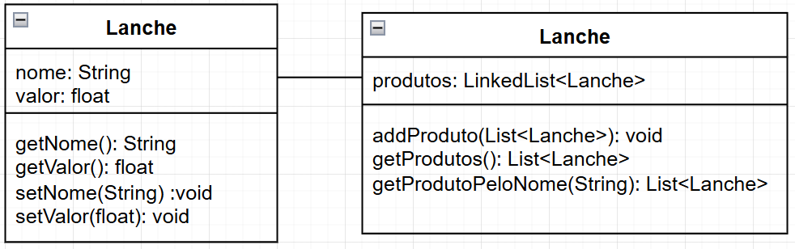

# Continuação

## 4. Diagrama de Classes UML



---

## 5. Código Java

### Lanches

```bash
package AmarelinhoLanches;

public class Lanche {

    private String nome;
    private float valor;

    public Lanche(String nome, float valor){
        this.valor = valor;
        this.nome = nome;
    }

    public String getNome(){
        return this.nome;
    }

    public float getValor(){
        return this.valor;
    }

    public void setNome(String nome){
        this.nome = nome;
    }

    public void setValor(float valor){
        this.valor = valor;
    }

}
```

### Pedido

```bash
package AmarelinhoLanches;

import java.util.List;
import java.util.LinkedList;

public class Pedido {
    private List<Lanche> produtos = new LinkedList<Lanche>();

    public void addProduto(List<Lanche> produtos){
        for(Lanche produto : produtos){
            this.produtos.add(produto);
        }
    }

    public List<Lanche> getProdutos(){
        return this.produtos;
    }

    public List<Lanche> getProdutoPeloNome(String nome){
        List<Lanche> resultado = new LinkedList<Lanche>();
        for(Lanche produto : this.produtos){
            if (produto.getNome().equals(nome)){
                resultado.add(produto);
            }
        }
        return resultado;
    }
}
```

---

## 6. Testes Automatizados

```bash
package AmarelinhoLanches;

import static org.junit.jupiter.api.Assertions.*;
import org.junit.jupiter.api.Test;
import java.util.List;

public class Teste {

    @Test
    void testAdicionarProduto() {
        Pedido pedido = new Pedido();
        Lanche produto = new Lanche("Lanche", 10);

        pedido.addProduto(List.of(produto));
        assertEquals(1, pedido.getProdutos().size());
    }

    @Test
    void testBuscarProdutos(){
        Pedido pedido = new Pedido();
        Lanche salada = new Lanche("X-Salada", 11);
        Lanche burguer = new Lanche("X-Burguer", 10);

        pedido.addProduto(List.of(burguer));
        pedido.addProduto(List.of(salada));

        assertEquals(2, pedido.getProdutos().size());

        for (Lanche lanche : pedido.getProdutos()){
            System.out.printf("Lanche: %s \nValor: R$ %.2f\n\n", lanche.getNome(), lanche.getValor());
        }
    }

    @Test
    void testBuscarProdutoPeloNome(){
        Pedido pedido = new Pedido();
        Lanche salada = new Lanche("X-Salada", 11);
        Lanche burguer = new Lanche("X-Burguer", 10);

        pedido.addProduto(List.of(burguer));
        pedido.addProduto(List.of(salada));

        assertEquals(2, pedido.getProdutos().size());

        for (Lanche lanche : pedido.getProdutoPeloNome("X-Salada")){
            System.out.printf("Lanche: %s \nValor: R$ %.2f\n\n", lanche.getNome(), lanche.getValor());
        }
    }
}
```

