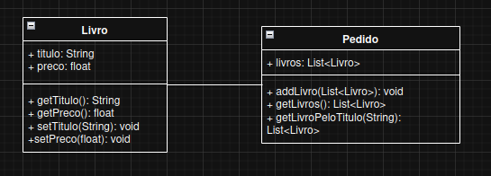

# Continuação

## 7. Diagrama de Classes UML



---

## 8. Código Java

### Livros

```bash
package LivrariaCentral;

public class Livro {

    private String titulo;
    private float preco;

    public Livro(String titulo, float preco){
        this.preco = preco;
        this.titulo = titulo;
    }

    public String getTitulo(){
        return this.titulo;
    }

    public float getPreco(){
        return this.preco;
    }

    public void setTitulo(String titulo){
        this.titulo = titulo;
    }

    public void setPreco(float preco){
        this.preco = preco;
    }

}
```

### Pedido

```bash
package LivrariaCentral;

import java.util.List;
import java.util.LinkedList;

public class Pedido {
    private List<Livro> livros = new LinkedList<Livro>();

    public void addLivro(List<Livro> livros){
        for(Livro livro : livros){
            this.livros.add(livro);
        }
    }

    public List<Livro> getLivros(){
        return this.livros;
    }

    public List<Livro> getLivroPeloTitulo(String titulo){
        List<Livro> resultado = new LinkedList<Livro>();
        for(Livro livro : this.livros){
            if (livro.getTitulo().equals(titulo)){
                resultado.add(livro);
            }
        }
        return resultado;
    }
}
```

---

## 9. Testes Automatizados

```bash
package LivrariaCentral;

import static org.junit.jupiter.api.Assertions.*;
import org.junit.jupiter.api.Test;
import java.util.List;

public class Teste {

    @Test
    void testAdicionarLivro() {
        Pedido pedido = new Pedido();
        Livro livro = new Livro("O Pequeno Príncipe", 25);

        pedido.addLivro(List.of(livro));
        assertEquals(1, pedido.getLivros().size());
    }

    @Test
    void testBuscarLivros(){
        Pedido pedido = new Pedido();
        Livro romance = new Livro("Orgulho e Preconceito", 30);
        Livro ficcao = new Livro("1984", 28);

        pedido.addLivro(List.of(ficcao));
        pedido.addLivro(List.of(romance));

        assertEquals(2, pedido.getLivros().size());

        for (Livro livro : pedido.getLivros()){
            System.out.printf("Livro: %s \nPreço: R$ %.2f\n\n", livro.getTitulo(), livro.getPreco());
        }
    }

    @Test
    void testBuscarLivroPeloTitulo(){
        Pedido pedido = new Pedido();
        Livro romance = new Livro("Orgulho e Preconceito", 30);
        Livro ficcao = new Livro("1984", 28);

        pedido.addLivro(List.of(ficcao));
        pedido.addLivro(List.of(romance));

        assertEquals(2, pedido.getLivros().size());

        for (Livro livro : pedido.getLivroPeloTitulo("1984")){
            System.out.printf("Livro: %s \nPreço: R$ %.2f\n\n", livro.getTitulo(), livro.getPreco());
        }
    }
}
```
