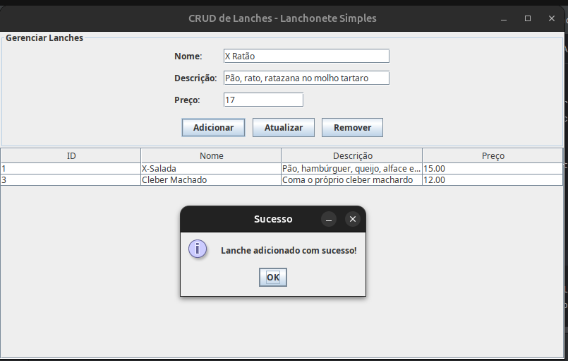
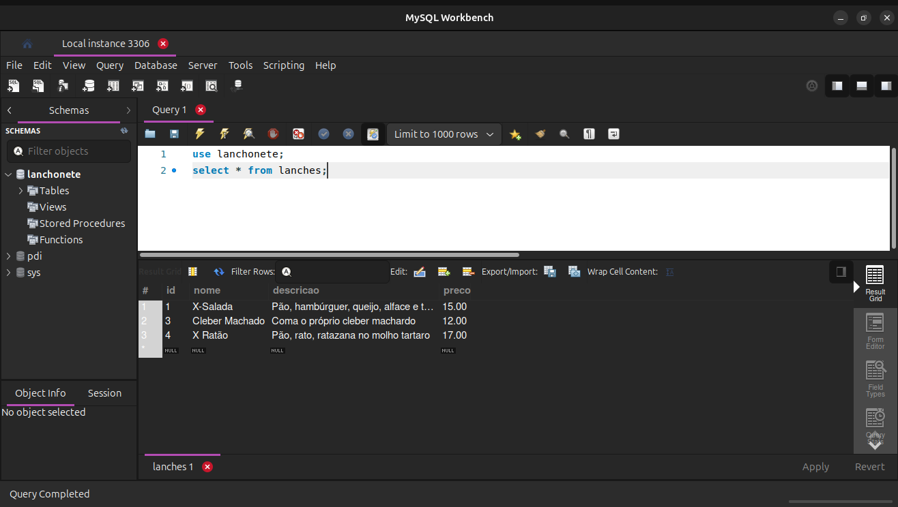

# Resumo do CRUD

O CRUD é o acrônimo em inglês para as quatro operações básicas e essenciais que todo sistema de gerenciamento de dados deve realizar. Ele é o coração da interação entre a sua aplicação e o banco de dados.

## Estrutura do Projeto

No meu projeto, decidi desenvolver um projeto CRUD de uma lanchonete. A separação de responsabilidades funciona assim:

    View: O usuário clica em "Adicionar Lanche" e preenche os campos.

    Controller: Recebe os dados da View, valida se o preço é positivo e chama o método DAO.

    DAO: Recebe o objeto Lanche e o transforma no comando SQL (INSERT INTO...).

    Factory: Fornece a conexão necessária para o DAO executar o comando no MySQL.

## Download

**Clique no botão abaixo** para baixar o projeto completo em formato ZIP.

## Imagens do Projeto

### Projeto Funcionando

### Print da adição no banco
