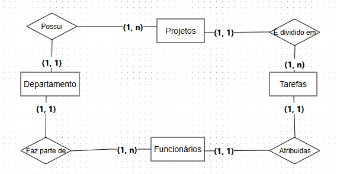

# Atividades Avaliativas

## 1. Design Thinking

### Processo de DT no desafio do seu API.

[Clique aqui para acessar o Figma](https://www.figma.com/design/nQRrEUCSDZTLhfBMC0cXbM/PDI?node-id=0-1&t=i1hD0nsofiUzZwHX-1)

---

## 2. Diagramas de Entidade

### Exercício 1
<i>"Diagrama de Entidade-Relacionamento para um sistema de vendas de livros:

Um cliente pode fazer muitos pedidos, enquanto cada pedido é composto por muitos livros. Além disso, um pedido é vinculado a apenas um cliente, enquanto um livro pode estar vinculado a muitos pedidos. Cada pedido deve ter um registro de pagamento vinculado a ele, mas um pagamento pode estar vinculado a muitos pedidos."</i>

### Exercício 2
<i>"Diagrama de Entidade-Relacionamento para um sistema de gestão de projetos:

Cada projeto pode ser dividido em várias tarefas, enquanto cada tarefa é atribuída a um funcionário específico. Além disso, cada funcionário é membro de um departamento específico. O departamento pode ser responsável por muitos projetos, enquanto cada projeto é gerenciado por um único departamento."</i>

### Exercício 3
<i>"Diagrama de Entidade-Relacionamento para um sistema de reserva de voos:

Cada companhia aérea pode ter vários voos, enquanto cada voo é composto por vários assentos. Cada assento é vinculado a um voo específico e pode ser reservado por um passageiro específico. Além disso, cada voo sai e chega em um aeroporto específico."</i>

### Exercício 4
<i>"Diagrama de Entidade-Relacionamento para um sistema de gerenciamento de bibliotecas:

Cada livro é escrito por um autor específico e publicado por uma editora específica. Um livro pode ser emprestado para vários usuários, enquanto cada usuário pode ter vários livros emprestados. Cada empréstimo é vinculado a um usuário e a um livro específico."</i>

### Exercício 5
<i>"Diagrama de Entidade-Relacionamento para um sistema de gestão de pacientes em um hospital:

Cada paciente é atendido em consultas realizadas por um ou mais médicos, enquanto cada consulta é realizada por um único médico e pode estar associada a um ou mais pacientes. Cada médico é membro de um departamento específico em um hospital, e um departamento pode ter vários médicos. Um hospital pode ter vários departamentos, cada um com seus próprios médicos e pacientes. Cada paciente tem um registro de informações pessoais, como nome, data de nascimento e endereço, e pode ter um histórico de consultas e tratamentos relacionados. Cada consulta tem uma data e hora específicas e pode ter um ou mais procedimentos médicos associados, como exames ou prescrições de medicamentos."</i>

