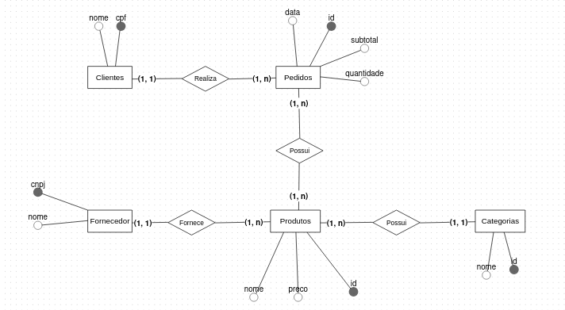
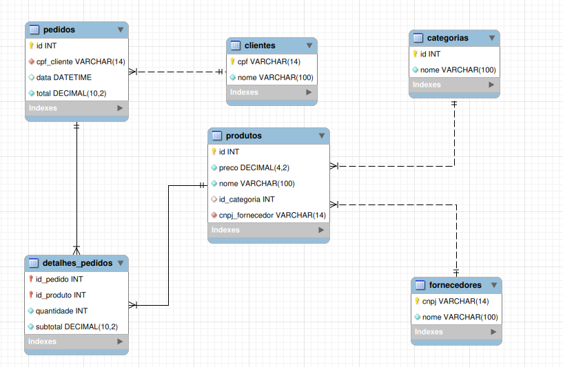

# Estrutura do Banco de Dados para Sistema de E-commerce

## 1. Introdução

Este documento descreve a estrutura e o funcionamento do banco de dados projetado para um sistema de e-commerce. O objetivo é gerenciar de forma eficiente as principais entidades de negócio: Clientes, Fornecedores, Produtos, Categorias e os Pedidos realizados.

A modelagem segue as boas práticas, evoluindo de um modelo conceitual (abstrato) para um modelo lógico (concreto) e, finalmente, para um modelo físico (implementação via scripts SQL).

---

## 2. Visão Geral e Modelos

A modelagem seguiu uma progressão padrão, partindo do abstrato (conceitual) para o concreto (lógico e físico).

### 2.1. Modelo Conceitual (Diagrama Entidade-Relacionamento)

Este modelo foca nas entidades de negócio e seus relacionamentos (1:N, N:M), sem se preocupar com detalhes de implementação.

Entidades Principais: Clientes, Pedidos, Produtos, Categorias, Fornecedores.

Relacionamento Chave: A relação N:M entre Pedidos e Produtos será resolvida no modelo lógico.



---

### 2.2. Modelo Lógico (Diagrama de Relacionamento)

Este modelo traduz o conceitual em tabelas, colunas, e define as Chaves Primárias (PK) e Chaves Estrangeiras (FK). A relação N:M (Pedidos-Produtos) foi transformada na tabela associativa detalhes_pedidos.



---

## 3. Estrutura das Tabelas (Modelo Lógico Detalhado)

Abaixo está a descrição detalhada de cada tabela identificada no modelo lógico.

### 3.1. clientes

* Propósito: 
- Armazena os dados dos clientes cadastrados.

* Colunas:
- cpf (PK, VARCHAR(14)): Chave Primária. Identificador único do cliente.
- nome (VARCHAR(100)): Nome do cliente.

---

### 3.2. fornecedores

* Propósito: 
- Armazena os dados dos fornecedores dos produtos.

* Colunas:
- cnpj (PK, VARCHAR(14)): Chave Primária. Identificador único do fornecedor.
- nome (VARCHAR(100)): Nome do fornecedor.

---

### 3.3. categorias

* Propósito:
- Organiza os produtos em seções (ex: "Eletrônicos", "Roupas").

* Colunas:
- id (PK, INT): Chave Primária. Identificador único da categoria.
- nome (VARCHAR(100)): Nome da categoria.

---

### 3.4. produtos

* Propósito:
- Armazena os itens que estão à venda.

* Colunas:
- id (PK, INT): Chave Primária. Identificador único do produto.
- nome (VARCHAR(100)): Nome/descrição do produto.
- preco (DECIMAL(4,2)): Preço unitário do produto.
- id_categoria (FK, INT): Chave Estrangeira que aponta para categorias.id.
- cnpj_fornecedor (FK, VARCHAR(14)): Chave Estrangeira que aponta para fornecedores.cnpj.

---

### 3.5. pedidos

* Propósito:
- Armazena o "cabeçalho" de cada transação de venda.

* Colunas:
- id (PK, INT): Chave Primária. Identificador único do pedido.
- cpf_cliente (FK, VARCHAR(14)): Chave Estrangeira que aponta para clientes.cpf.
- data (DATETIME): Data e hora em que o pedido foi realizado.
- total (DECIMAL(10,2)): O valor total consolidado do pedido.

---

3.6. detalhes_pedidos

* Propósito:
- Tabela associativa que resolve o relacionamento N:M entre pedidos e produtos.

* Colunas:
- id_pedido (FK, INT): Chave Estrangeira que aponta para pedidos.id.
- id_produto (FK, INT): Chave Estrangeira que aponta para produtos.id.
- quantidade (INT): A quantidade do produto específico neste pedido.
- subtotal (DECIMAL(10,2)): O valor calculado (Preço do Produto * Quantidade).

---

## 4. Modelo Físico (Scripts SQL para MySQL)

O modelo físico é a implementação direta do modelo lógico em linguagem SQL, definindo tipos de dados exatos, constraints (restrições) como NOT NULL e AUTO_INCREMENT, e o engine de armazenamento (InnoDB).

```bash
CREATE DATABASE `bar`;

USE `bar`;

-- Tabela Categorias
CREATE TABLE `categorias` (
  `id` int NOT NULL AUTO_INCREMENT,
  `nome` varchar(100) NOT NULL,
  PRIMARY KEY (`id`)
) ENGINE=InnoDB DEFAULT CHARSET=utf8mb4 COLLATE=utf8mb4_0900_ai_ci;

-- Tabela Fornecedores
CREATE TABLE `fornecedores` (
  `cnpj` varchar(14) NOT NULL,
  `nome` varchar(100) NOT NULL,
  PRIMARY KEY (`cnpj`)
) ENGINE=InnoDB DEFAULT CHARSET=utf8mb4 COLLATE=utf8mb4_0900_ai_ci;

-- Tabela Clientes
CREATE TABLE `clientes` (
  `cpf` varchar(14) NOT NULL,
  `nome` varchar(100) NOT NULL,
  PRIMARY KEY (`cpf`)
) ENGINE=InnoDB DEFAULT CHARSET=utf8mb4 COLLATE=utf8mb4_0900_ai_ci;

-- Tabela Produtos (com Chaves Estrangeiras para Categoria e Fornecedor)
CREATE TABLE `produtos` (
  `id` int NOT NULL AUTO_INCREMENT,
  `preco` decimal(4,2) NOT NULL DEFAULT '0.00',
  `nome` varchar(100) NOT NULL,
  `id_categoria` int DEFAULT NULL,
  `cnpj_fornecedor` varchar(14) NOT NULL,
  PRIMARY KEY (`id`),
  KEY `id_categoria` (`id_categoria`),
  KEY `cnpj_fornecedor` (`cnpj_fornecedor`),
  CONSTRAINT `produtos_ibfk_1` FOREIGN KEY (`id_categoria`) REFERENCES `categorias` (`id`) ON DELETE SET NULL,
  CONSTRAINT `produtos_ibfk_2` FOREIGN KEY (`cnpj_fornecedor`) REFERENCES `fornecedores` (`cnpj`) ON DELETE RESTRICT
) ENGINE=InnoDB DEFAULT CHARSET=utf8mb4 COLLATE=utf8mb4_0900_ai_ci;

-- Tabela Pedidos (com Chave Estrangeira para Cliente)
CREATE TABLE `pedidos` (
  `id` int NOT NULL AUTO_INCREMENT,
  `cpf_cliente` varchar(14) NOT NULL,
  `data` datetime DEFAULT CURRENT_TIMESTAMP,
  `total` decimal(10,2) NOT NULL DEFAULT '0.00',
  PRIMARY KEY (`id`),
  KEY `fk_pedidos_clientes` (`cpf_cliente`),
  CONSTRAINT `fk_pedidos_clientes` FOREIGN KEY (`cpf_cliente`) REFERENCES `clientes` (`cpf`) ON DELETE CASCADE ON UPDATE CASCADE
) ENGINE=InnoDB DEFAULT CHARSET=utf8mb4 COLLATE=utf8mb4_0900_ai_ci;

-- Tabela Detalhes do Pedido (Chave Composta e Estrangeiras)
CREATE TABLE `detalhes_pedidos` (
  `id_pedido` int NOT NULL,
  `id_produto` int NOT NULL,
  `quantidade` int NOT NULL,
  `subtotal` decimal(10,2) NOT NULL DEFAULT '0.00',
  PRIMARY KEY (`id_pedido`, `id_produto`),
  KEY `id_produto` (`id_produto`),
  CONSTRAINT `detalhes_pedidos_ibfk_1` FOREIGN KEY (`id_pedido`) REFERENCES `pedidos` (`id`) ON DELETE CASCADE,
  CONSTRAINT `detalhes_pedidos_ibfk_2` FOREIGN KEY (`id_produto`) REFERENCES `produtos` (`id`) ON DELETE CASCADE
) ENGINE=InnoDB DEFAULT CHARSET=utf8mb4 COLLATE=utf8mb4_0900_ai_ci;
```