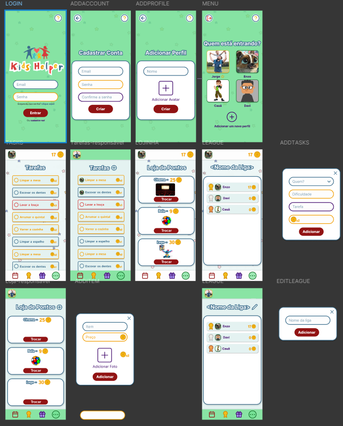

# KidsHelper: Aprendendo e Divertindo-se com Responsabilidade

Um aplicativo educativo para transformar tarefas do dia a dia em desafios empolgantes e gratificantes para crianças.

## Sobre o Projeto

O KidsHelper é um aplicativo educativo e interativo criado para ajudar as crianças a desenvolverem habilidades de organização, responsabilidade e autonomia de forma divertida e envolvente. O objetivo é transformar tarefas cotidianas, como arrumar o quarto, cuidar dos próprios objetos e realizar as tarefas escolares, em uma grande aventura.

Por meio de jogos, desafios e recompensas, o KidsHelper ensina as crianças a:

* Gerenciar o tempo de forma inteligente;

* Estabelecer metas pessoais;

* Criar hábitos saudáveis de estudo e organização.

Além de ser uma ferramenta divertida para os pequenos, o app também oferece recursos para os pais acompanharem o progresso dos filhos, incentivando-os de maneira positiva e colaborativa em seu desenvolvimento pessoal e acadêmico.

O grande objetivo do KidsHelper é preparar as crianças para os desafios da vida, promovendo a autonomia e a responsabilidade de forma lúdica, educativa e cheia de diversão!

## Funcionalidades Principais

* Gamificação de Tarefas: Crie missões diárias ou semanais e transforme obrigações em desafios com pontos e medalhas.

* Sistema de Metas e Recompensas: As crianças podem acumular pontos para trocar por recompensas definidas em conjunto com os pais (ex: um passeio, um brinquedo, tempo extra de tela).

* Gerenciamento de Tempo: Ferramentas visuais que ajudam a criança a entender a importância de organizar seu dia.

* Painel para os Pais: Uma área restrita onde os pais podem criar tarefas, aprovar a conclusão e acompanhar o desenvolvimento dos filhos.

* Hábitos Saudáveis: Módulos para incentivar rotinas de estudo, leitura, higiene pessoal e outras atividades importantes.

## Design (UI/UX)

O design do KidsHelper foi pensado para ser colorido, intuitivo e atrativo para o público infantil, com uma interface limpa e fácil de navegar.

### Telas do Aplicativo

### Protótipo no Figma

O protótipo completo, com todas as telas e fluxos de navegação, está disponível no Figma. Sinta-se à vontade para explorar!

<a href="https://www.figma.com/design/LssOuive0QlkcDvL1QAEl2/KIDSHELPER?node-id=0-1&t=J4uL6pV3c6DDPnWP-1">Acessar o design do KidsHelper no Figma</a>

## Brainstorm do Projeto

Esta seção contém as ideias iniciais, anotações e o processo de concepção que deram origem ao KidsHelper.

"<i>

### Sistema de Quarto Personalizável (estilo The Sims)
 * Criança monta e customiza o próprio quarto virtual

### Sistema de Gacha
 * Máquinas de surpresa para desbloquear itens raros

### Pet Virtual Interativo (estilo Talking Tom)
 * Humor do pet vinculado ao desempenho nas atividades
 * Estados alterados conforme validação dos pais

 ### Modalidades de Jogo
 * Casual: atividades repetíveis
 * Ranqueada: atividades únicas com tempo limitado

### Sistema de Envio de Atividades
 * Pais podem enviar tarefas personalizadas

### Sistema de Ranking Educacional
 * Temas específicos com cronômetro
 * Medalhas: Bronze, Prata, Ouro, Diamante, Filho Preferido

### Competição Familiar
 * Leaderboards entre membros da família

### Sistema de Trilha/Tabuleiro
 * Progressão por casas conforme conclusão de atividades

### Painel de Controle Parental
 * Acesso às tarefas concluídas e pendentes
 * Gerenciamento de atividades
 
 ### Recompensas Diárias
 * Caixa diária com itens aleatórios
 ### Sistema de Metas (Ofensiva)
 * Pais definem objetivos para liberação de recompensas
### Funcionalidades (pós-votação)
 * Tracking de tarefas com sistema de metas
 * Acesso remoto dos pais via dispositivo próprio
 * Comunidade com criação de competições
 * Loja virtual com pontos de atividade
</i>"